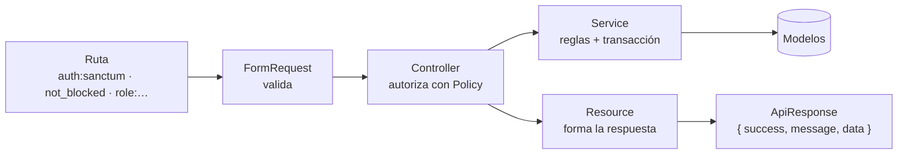

# Arquitectura del backend

Guía de cómo está construido el backend y qué reglas seguir al agregar código. Si algo no está aquí, copia el patrón del módulo más parecido que ya exista.

- **Modelo de datos:** [modelo-de-datos.md](modelo-de-datos.md)
- **Contrato de la API:** [api/convenciones.md](api/convenciones.md) y [api/endpoints.md](api/endpoints.md)
- **Tiempo real:** [tiempo-real.md](tiempo-real.md)
- **Documentación interactiva:** `http://127.0.0.1:8000/docs/api` (local), generada por Scramble

## 1. Stack

| Pieza | Versión | Uso |
|-------|---------|-----|
| PHP | 8.2+ | |
| Laravel | 12 | Framework |
| Sanctum | 4 | Autenticación por token Bearer |
| Reverb | 1 | WebSockets: chat, estado en línea, notificaciones |
| Scramble | 0.13 | Documentación OpenAPI generada desde el código |
| MySQL | 8 | Base de datos (desarrollo y producción) |
| SQLite en memoria | — | Solo para tests |
| Pest | 3 | Tests |
| Pint | 1 | Formato de código (estilo Laravel) |

## 2. Estructura

```
app/
├── Broadcasting/           Autorización de canales de tiempo real con lógica propia.
├── Enums/                  Estados, roles y tipos. Nunca strings sueltos.
├── Events/                 Eventos que se transmiten por Reverb (ver tiempo-real.md).
├── Http/
│   ├── Controllers/Api/    Un controller por recurso. Delgados.
│   ├── Middleware/         role:…, not_blocked
│   ├── Requests/           Validación de entrada (un FormRequest por acción con body).
│   └── Resources/          Forma de cada respuesta JSON.
├── Models/                 Eloquent: relaciones, casts, scopes. Sin lógica de negocio.
├── Policies/               Permisos sobre un recurso concreto.
├── Services/               Reglas de negocio, transacciones, archivos.
└── Support/ApiResponse.php Formato único de respuesta.
database/
├── migrations/             Esquema completo (ver modelo-de-datos.md).
├── factories/              Datos de prueba para tests.
└── seeders/                Catálogos (comunas, categorías) + DemoSeeder.
routes/api.php              Todas las rutas, prefijo /api/v1.
routes/channels.php         Canales de tiempo real.
tests/Feature/              Un archivo por recurso.
```

## 3. Recorrido de una petición



### Qué hace cada capa

| Capa | Hace | No hace |
|------|------|---------|
| **Ruta** | Decide *quién puede entrar* según autenticación y tipo de cuenta (`role:client`). | Reglas sobre un recurso concreto. |
| **FormRequest** | Valida formato y existencia de datos. `authorize()` siempre devuelve `true`. | Permisos. Lógica de negocio. |
| **Controller** | Llama a la Policy (`$this->authorize(...)`), llama al Service, devuelve un Resource con `$this->ok()`, `created()` o `paginated()`. | Consultas complejas, reglas de negocio, `response()->json()` a mano. |
| **Policy** | Decide sobre *un recurso concreto*: ¿es el dueño?, ¿está verificado? Devuelve `Response::deny('mensaje')` cuando el mensaje ayuda al usuario. | Validar datos. Cambiar estados. |
| **Service** | Reglas de negocio, transacciones, cambios de estado, archivos. Lanza `ValidationException` o `abort(409, …)` cuando una regla no se cumple. | Leer el `Request`. Devolver JSON. |
| **Model** | Relaciones, `casts()` con enums, scopes reutilizables (`publiclyListed`, `occupyingSchedule`). | Lógica de negocio. |
| **Resource** | Decide qué campos salen y cómo (fechas ISO 8601, URLs de archivos, dinero como número). | Consultas: las relaciones se cargan antes con `load()`/`with()`. |

### ¿Cuándo crear un Service?

Cuando la acción **toca más de un modelo, necesita una transacción, cambia un estado o maneja archivos**. Una lectura simple por usuario puede quedarse en el controller usando scopes (ver `FavoriteController`). No crear Services vacíos "por si acaso".

No se usa el patrón Repository: Eloquent ya cumple ese rol. Las consultas reutilizables van como *scopes* en el modelo.

## 4. Reglas transversales

### Permisos
1. **Tipo de cuenta** → middleware en la ruta: `->middleware('role:client')`, `'role:professional,admin'`.
2. **Recurso concreto** → Policy, llamada desde el controller.
3. **Usuario bloqueado** → middleware `not_blocked`, ya aplicado a todo el grupo autenticado.

### Enums
- Todo estado, rol o tipo es un enum de `app/Enums` con *cast* en el modelo. En el código se compara con el enum (`$booking->status === BookingStatus::Pending`), nunca con el string.
- En la base de datos se guardan como `string(20)`, no como `ENUM` de MySQL, para poder agregar valores sin migraciones.
- Las transiciones de una reserva están en `BookingStatus::allowedTransitions()`. Todo cambio de estado pasa por `BookingService::transition()`, que valida y deja auditoría.

### Archivos
Todo archivo pasa por `App\Services\UploadService`:

| Disco | Contenido | Acceso |
|-------|-----------|--------|
| `public` | Avatares, portafolio | URL directa |
| `local` (privado) | Documentos KYC, adjuntos del chat | URL firmada temporal (`temporaryPrivateUrl`) |

Si una operación falla después de subir un archivo, el Service borra el archivo (ver `AuthService::withAvatar`).

### Fechas y dinero
- Zona horaria de la app: `America/Bogota`. Las respuestas usan ISO 8601 con desfase (`2026-10-02T09:00:00-05:00`).
- Dinero en pesos colombianos, `decimal(12,2)` en BD, número en JSON.

### Respuestas y errores
Nunca armar JSON a mano. Éxito con `$this->ok()`, `$this->created()`, `$this->paginated()`. Los errores (401, 403, 404, 409, 422, 429, 500) se transforman solos al formato estándar en `bootstrap/app.php`. Formato completo en [api/convenciones.md](api/convenciones.md).

## 5. Tests

- **Cada endpoint tiene tests** del caso feliz, de validación y de permisos. Un PR sin tests no se aprueba.
- Corren sobre SQLite en memoria (`phpunit.xml`), se reinicia en cada test. **Nunca tocan tu base MySQL.**
- Usa factories con estados: `User::factory()->professional()->verified()`, `Booking::factory()->status(BookingStatus::Completed)`.
- Helper compartido en `tests/Pest.php`: `professionalWithService()`.
- Autenticación en tests: `Sanctum::actingAs($user)`.

```bash
php artisan test              # toda la suite
php artisan test --filter=Bookings
vendor/bin/pint --dirty       # formatear lo que cambiaste
```

## 6. Checklist para un módulo nuevo

1. ¿Necesita tablas nuevas? Primero se actualiza [modelo-de-datos.md](modelo-de-datos.md) y se acuerda con el equipo. Después la migración.
2. Enum si hay estados o tipos.
3. Rutas en `routes/api.php` dentro del grupo correcto, con `role:` si aplica.
4. FormRequest por cada acción con body.
5. Policy si hay reglas sobre un recurso concreto.
6. Service si aplica la regla de la sección 3.
7. Resource para la respuesta.
8. Tests en `tests/Feature/<Recurso>Test.php`.
9. Documentar el endpoint en [api/endpoints.md](api/endpoints.md) (moverlo de "Planeados" a "Implementados"). Revisar que `/docs/api` lo muestre bien; si Scramble no infiere algo, agregar PHPDoc al método del controller.
10. Si emite eventos en tiempo real, seguir la convención de [tiempo-real.md](tiempo-real.md).
11. `vendor/bin/pint --dirty` y `php artisan test` en verde.
