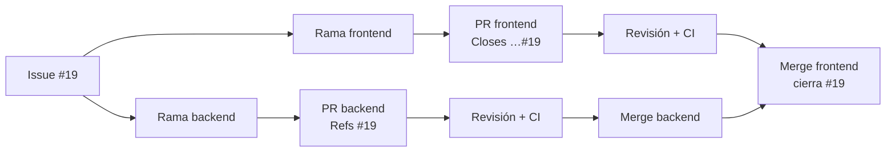

# Guía de trabajo: de un issue a `main`

Cómo trabajamos día a día en Maestros a un clic, paso a paso y con los comandos exactos. Las reglas de fondo están en [CONTRIBUTING.md](../CONTRIBUTING.md); esta guía es el "cómo".

**Repos:**
- Backend (aquí están los issues): https://github.com/LordCasta/maestros_a_un_clic_backend
- Frontend: https://github.com/LordCasta/maestros_a_un_clic_frontend

---

## 1. Preparación (una sola vez)

### Herramientas
- PHP 8.2+ con `pdo_mysql` y `pdo_sqlite`, Composer, MySQL 8 (Laragon sirve), Node.js 20.19+ o 22.12+, Git.
- GitHub CLI: `winget install --id GitHub.cli`, abrir una terminal nueva y `gh auth login` (GitHub.com → HTTPS → navegador).

### Clonar y levantar todo

```bash
git clone https://github.com/LordCasta/maestros_a_un_clic_backend.git
git clone https://github.com/LordCasta/maestros_a_un_clic_frontend.git
```

**Backend** (crea antes la base `maestros_backend` en MySQL):
```bash
cd maestros_a_un_clic_backend
composer install
cp .env.example .env            # ajusta DB_USERNAME y DB_PASSWORD
php artisan key:generate
php artisan migrate:fresh --seed
php artisan storage:link
composer dev                    # API :8000 + cola + Reverb :8080
```

**Frontend** (en otra terminal):
```bash
cd maestros_a_un_clic_frontend
npm install
cp .env.example .env
npm run dev                     # http://localhost:5173
```

Comprueba que funciona entrando con `cliente@maestros.test` / `password`. Otras cuentas: `profesional@maestros.test`, `pendiente@maestros.test`, `admin@maestros.test` (todas con `password`).

### Antigravity
Abre **cada repo como su propio workspace**. Antigravity lee solo `AGENTS.md` en cada uno; en el frontend además activa las reglas de diseño y arquitectura de `.agents/rules/` cuando editas archivos. No hace falta configurar nada más.

### Lee una vez
1. Backend: [docs/arquitectura.md](arquitectura.md), [docs/api/convenciones.md](api/convenciones.md), [docs/api/endpoints.md](api/endpoints.md).
2. Frontend: `docs/arquitectura.md` y `docs/sistema-de-diseno.md`.
3. Abre `http://localhost:5173/_ui` para ver la paleta y los componentes.
4. Recorre el módulo de favoritos en los dos repos: es el ejemplo a copiar.

---

## 2. Qué me toca

- Tus issues: **Issues → filtro `is:open assignee:@me`** en el repo del backend.
- Tus módulos y el orden sugerido están en la tabla de [CONTRIBUTING.md](../CONTRIBUTING.md#1-reparto-por-módulos).
- Cada issue tiene los criterios de aceptación como checklist, el módulo, los endpoints del contrato y de qué depende. Los que dicen **"fase 0: parcial"** explican qué ya está hecho y qué falta.

Elige un issue que no dependa de algo sin terminar y avisa en el issue que empiezas:

```bash
gh issue comment 19 -R LordCasta/maestros_a_un_clic_backend --body "Empiezo con esta HU."
```

---

## 3. El flujo de una HU, paso a paso

Ejemplo: **HU019 · Cambio de contraseña (#19)**. Casi todas las HU tienen parte de backend y de frontend; se trabaja primero el backend.



### Paso 1 — Rama en el backend

Siempre desde `main` actualizado:

```bash
git checkout main
git pull
git checkout -b feature/HU019-cambio-contrasena
```

Nombres de rama: `feature/HU0xx-descripcion-corta`, `fix/…`, `docs/…`, `chore/…`. Usa el **mismo nombre** en los dos repos.

### Paso 2 — Implementar el backend

Sigue el checklist de [docs/arquitectura.md § 6](arquitectura.md#6-checklist-para-un-módulo-nuevo): migración nueva si hace falta (nunca editar una existente), FormRequest, Policy, Service, Resource, rutas, tests y documentar el endpoint en `docs/api/endpoints.md` (moverlo de "Planeados" a "Implementados").

Con Antigravity, algo así:

> Lee AGENTS.md y docs/. Implementa el backend de la HU019 (issue #19): `PUT /me/password` según docs/api/endpoints.md, con FormRequest, tests de caso feliz, validación y permisos, y documenta el endpoint. Al terminar corre `php artisan test` y `vendor/bin/pint --dirty`.

Revisa lo que generó: tú respondes por el código.

### Paso 3 — Commits pequeños

```bash
git add .
git commit -m "feat(cuenta): cambiar contraseña con la actual (HU019)"
```

Formato: `tipo(módulo): descripción en español`. Tipos: `feat`, `fix`, `docs`, `test`, `refactor`, `chore`. Varios commits pequeños es mejor que uno gigante (al fusionar se juntan en uno solo).

### Paso 4 — Verificar y subir

```bash
php artisan test
vendor/bin/pint --dirty
git push -u origin feature/HU019-cambio-contrasena
```

### Paso 5 — PR del backend

```bash
gh pr create --fill --reviewer LordCasta
```

O desde GitHub con el botón "Compare & pull request". En la plantilla:
- **Título** en formato de commit: `feat(cuenta): cambio de contraseña (HU019)`.
- **Issue**: `Refs #19`. Usa `Refs` y no `Closes`, porque falta el frontend. Si la HU fuera solo de backend, usa `Closes #19`.
- **Cómo probarlo**: endpoint, cuenta demo y pasos.

### Paso 6 — Frontend

```bash
cd ../maestros_a_un_clic_frontend
git checkout main && git pull
git checkout -b feature/HU019-cambio-contrasena
```

Trabaja contra tu backend local, que sigue en la rama del paso 1. Con Antigravity:

> Lee AGENTS.md. Implementa el frontend de la HU019 (issue LordCasta/maestros_a_un_clic_backend#19) en el módulo cuenta usando el endpoint `PUT /me/password`. Sigue la skill nuevo-modulo y el sistema de diseño. Al terminar corre `npm run lint`, `npm run type-check` y `npx vitest run`.

Verifica y sube:

```bash
npm run lint && npm run format && npm run type-check && npx vitest run
git push -u origin feature/HU019-cambio-contrasena
gh pr create --fill --reviewer LordCasta
```

En la plantilla del frontend:
- **Issue**: `Closes LordCasta/maestros_a_un_clic_backend#19` (este PR es el que cierra el issue).
- **PR del backend relacionado**: el enlace del paso 5.
- **Capturas** si cambia la interfaz.

### Paso 7 — Revisión

- El CI corre solo en cada push. Si sale en rojo: [§ 4. Si el CI falla](#4-si-el-ci-falla).
- La otra persona revisa. Si pide cambios: corrige en la misma rama, push y responde el comentario.
- Revisar un PR ajeno: pestaña "Files changed" → comentarios por línea → "Review changes" → Approve o Request changes. Qué mirar está en [CONTRIBUTING.md § 5](../CONTRIBUTING.md#5-pull-requests).
- La aprobación **no es obligatoria**: si en 48 horas nadie revisó y el CI está en verde, fusionas tú. Lo que toca `shared`, el esquema o el contrato de la API sí espera el visto bueno.

### Paso 8 — Fusionar (merge)

Con el CI en verde (y la revisión hecha o las 48 horas cumplidas), **primero el backend, después el frontend**:

```bash
gh pr merge --squash --delete-branch      # en cada repo, desde la rama del PR
```

O el botón **"Squash and merge"** en GitHub. Al fusionar el frontend, el issue #19 se cierra solo. Antes de que se cierre, marca en el issue los criterios cumplidos.

### Paso 9 — Volver a `main`

En los dos repos:

```bash
git checkout main
git pull
```

En el backend, si llegaron migraciones nuevas: `php artisan migrate`.

---

## 4. Si el CI falla

GitHub no deja fusionar un PR con el CI en rojo. No es un castigo: es el aviso de que algo se rompió antes de que llegue a `main`.

### 1. Ver qué falló

En el PR, pestaña **Checks** (o el enlace "Details" junto a la ✗) → abre el paso en rojo → baja hasta las últimas líneas: ahí está el error. Desde la terminal:

```bash
gh pr checks                    # qué jobs fallaron
gh run view --log-failed        # el log solo de lo que falló
```

### 2. Reproducirlo en tu máquina

El CI corre los mismos comandos que tú. Corre el que falló:

| Repo | Paso en rojo | Comando local | Arreglo típico |
|------|--------------|---------------|----------------|
| Backend | Formato (Pint) | `vendor/bin/pint --test` | `vendor/bin/pint` y commit |
| Backend | Tests (Pest) | `php artisan test` | Leer qué test falla y por qué: ¿bug tuyo o test desactualizado por un cambio a propósito? |
| Backend | Solo falla en PHP 8.2 | — | Usaste algo de PHP 8.3+; reescríbelo compatible |
| Frontend | `npm ci` / lockfile | `npm run lint:lockfile` | `npm install` y commit del `package-lock.json` |
| Frontend | Lint | `npm run lint` | `npm run fix` para lo automático; el resto, a mano |
| Frontend | Tokens de diseño | `npm run lint:tokens` | Cambia el color por un token (`docs/sistema-de-diseno.md`) |
| Frontend | Formato | `npm run format:check` | `npm run format` y commit |
| Frontend | Tipos | `npm run type-check` | Corrige el tipo; no uses `any` ni `@ts-ignore` para callarlo |
| Frontend | Tests | `npx vitest run` | Igual que en el backend |
| Frontend | Build | `npm run build` | Suele ser un import roto o un archivo movido |

### 3. Corregir y subir

```bash
git add .
git commit -m "fix: corregir <lo que falló>"
git push
```

El CI vuelve a correr solo sobre el mismo PR. No hace falta abrir otro.

### Reglas
- **No borres ni saltes un test, ni desactives una regla de lint, para que pase.** Si un test está mal porque el comportamiento cambió a propósito, actualízalo y explícalo en el PR.
- **"En mi máquina sí pasa"**: casi siempre es una dependencia nueva sin commitear, el lockfile, o algo de Windows (mayúsculas en nombres de archivo: Linux las distingue).
- **Falla algo que no tocaste** (p. ej. una caída de red al instalar): botón **Re-run failed jobs** en la pestaña Checks, o `gh run rerun --failed`. Si vuelve a fallar, avísalo en el PR.
- El job **"Seguridad de dependencias"** no bloquea: si sale en rojo es una alerta nueva publicada sobre una librería. Avísalo, y se resuelve en un PR aparte.
- Si no logras resolverlo, deja el PR abierto, comenta qué probaste y pide ayuda.

---

## 5. Durante el trabajo

| Situación | Qué hacer |
|-----------|-----------|
| Pasaron días y `main` avanzó | `git fetch origin && git rebase origin/main`, resolver conflictos, `git push --force-with-lease` |
| Conflicto en un rebase | Edita los archivos marcados, `git add <archivo>`, `git rebase --continue`. Si te enredas: `git rebase --abort` y pregunta |
| Necesito un endpoint que no está en el contrato | No lo inventes: proponlo en el issue y acuérdalo antes |
| Necesito cambiar algo de `src/shared`, `src/app` (frontend) o `Support/`, `bootstrap/app.php` (backend) | Avísalo en el PR: lo revisan los dos |
| Necesito una tabla o columna nueva | Migración **nueva** + actualizar `docs/modelo-de-datos.md` en el mismo PR |
| Mi HU depende de una del otro | Coméntalo en ambos issues; mientras tanto avanza en otra |
| `main` trae migraciones nuevas | `php artisan migrate`. Si la base local quedó rara: `php artisan migrate:fresh --seed` (borra tus datos locales) |
| El puerto 8000 está ocupado | Otro proyecto lo usa: ciérralo o usa `php artisan serve --port=8001` y ajusta `VITE_API_BASE_URL` |
| No sé si algo está bien | Abre el PR como **borrador** (`gh pr create --draft`) y pide opinión |

---

## 6. Comunicación

- **Dudas y decisiones de una HU** → comentario en su issue (queda escrito para los dos y para la IA).
- **Dudas de código** → comentario en el PR, en la línea concreta.
- **Cambios de convenciones** (paleta, estructura, reglas para la IA) → PR que modifique `docs/`, `AGENTS.md` o `.ai/guidelines/`, revisado por los dos.
- Un mensaje corto al empezar y al abrir un PR ayuda a no pisarse.

---

## 7. Chuleta

```bash
# Empezar una HU
git checkout main && git pull && git checkout -b feature/HU0xx-descripcion

# Verificar
php artisan test && vendor/bin/pint --dirty                                   # backend
npm run lint && npm run format && npm run type-check && npx vitest run        # frontend

# Subir y abrir PR
git push -u origin HEAD
gh pr create --fill --reviewer LordCasta        # o --reviewer barenas12

# Ver mis issues y PRs
gh issue list -R LordCasta/maestros_a_un_clic_backend --assignee @me
gh pr status

# Fusionar y volver a main
gh pr merge --squash --delete-branch
git checkout main && git pull
```
