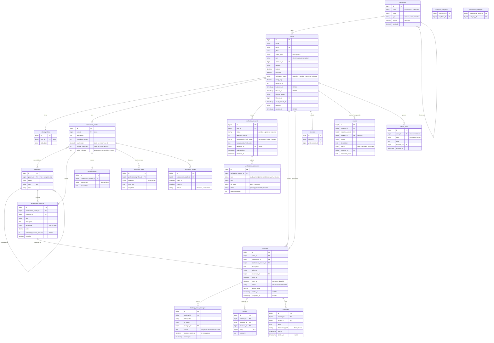
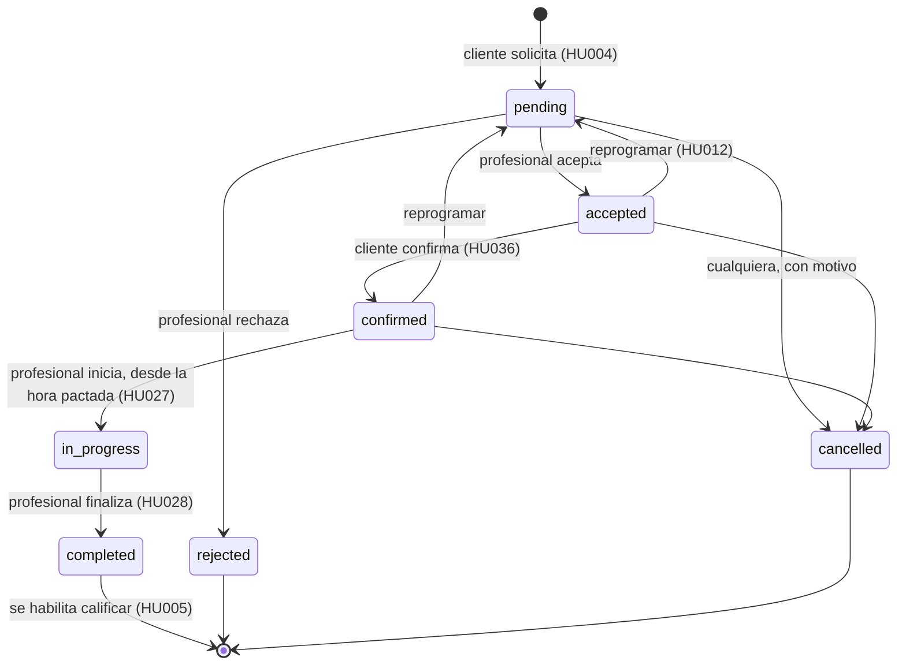

# Modelo de datos — Maestros a un clic

> **Estado:** v1 aprobada e implementada en `database/migrations` (fase 0, 2026-09-30). Este documento es la fuente de verdad del esquema: cualquier cambio se acuerda aquí primero y después se escribe la migración.

## 1. Decisiones de diseño

| # | Decisión | Motivo |
|---|----------|--------|
| D1 | Se reescriben las migraciones desde cero (`migrate:fresh`) en lugar de agregar migraciones de cambio. | El sistema no está en producción. Un esquema limpio se lee y se documenta mejor. |
| D2 | Una sola tabla `users` con `role` (`client`, `professional`, `admin`) y perfiles 1:1 por rol. | Ya está así y funciona. Login, tokens y notificaciones quedan unificados. |
| D3 | El estado de verificación vive **solo** en `users.verification_status`. Se elimina `is_verified` de `users` y de `professional_profiles`. | Hoy está duplicado y puede quedar inconsistente. |
| D4 | Las comunas son una tabla (`communes`) con coordenadas del centroide y vecinas. | HU002 (sugerir comunas aledañas), HU022 (ubicación manual validada), filtros confiables. Hoy la comuna es texto libre. |
| D5 | Las categorías tienen jerarquía (`parent_id`), reemplazando `specialties`. | HU010 y HU033 piden categoría y subcategoría. |
| D6 | El profesional publica **servicios** (`professional_services`) con precio y duración estimada. La reserva apunta a un servicio. | HU009, HU047 y el cálculo del bloque de agenda que ocupa cada reserva. |
| D7 | La disponibilidad se modela como horario semanal (`availability_rules`) + excepciones (`availability_blocks`). Los huecos libres se **calculan**, no se guardan. | Evita mantener miles de slots sincronizados. Cruces imposibles: se valida contra reservas activas + descanso configurable (HU003). |
| D8 | Cada cambio de estado de una reserva queda en `booking_status_changes`. | Auditoría, motivo de cancelación, fecha anterior al reprogramar (HU012), historial (HU026). |
| D9 | Documentos KYC (selfie, cédula, certificados, evidencias) van al disco **privado** y solo se sirven con URL firmada temporal a su dueño y a admins. El portafolio sigue siendo público. | Ley 1581 de 2012. Hoy cualquiera con la URL puede ver una cédula. |
| D10 | La consulta de antecedentes se registra manualmente por el admin dentro de la solicitud de verificación. | No existe una API pública de la Policía/Procuraduría para integrar; se deja el campo listo para un proveedor futuro. |
| D11 | Notificaciones con la tabla nativa `notifications` de Laravel (canal `database`). | HU018 sin reinventar nada; se puede sumar broadcast en tiempo real después. |
| D12 | Borrado de cuenta con *soft delete* + anonimización. | HU023 exige que no se pierda el historial de reservas y reseñas de la otra parte. |
| D13 | Promedio de calificación cacheado en `users` (`rating_avg`, `rating_count`). | Ordenar y filtrar por calificación (HU010) sin agregaciones en cada búsqueda. |
| D14 | El registro solo crea la cuenta y el perfil. Los documentos de identidad se envían después, en el módulo de verificación, igual para clientes y profesionales. El usuario nace `unverified` y pasa a `pending` al enviar documentos. | HU006/HU007 piden registro con correo y contraseña; HU008/HU013 describen la verificación como paso posterior. Registro más corto y módulos independientes. |
| D15 | Estados, roles y tipos se guardan como `string(20)` y se modelan con enums de PHP (`app/Enums`), no con `ENUM` de MySQL. | Agregar un valor no requiere migración, y el código nunca compara contra strings sueltos. |

## 2. Diagrama entidad-relación

Tablas de infraestructura de Laravel que se mantienen sin cambios: `password_reset_tokens`, `personal_access_tokens`, `notifications`, `sessions`, `cache`, `jobs`.

## 3. Máquina de estados de una reserva

- **Ocupan agenda** las reservas en `pending`, `accepted`, `confirmed` e `in_progress`. Cancelar o rechazar libera el bloque (HU012).
- **Reprogramar** no es un estado final: cambia `starts_at`, vuelve a `pending` para que el profesional acepte el nuevo horario, y guarda la fecha anterior en `booking_status_changes`.

## 4. Trazabilidad historia de usuario → tablas

| HU | Tablas / campos |
|----|-----------------|
| HU001, HU006, HU007, HU019, HU020, HU021, HU050 | `users`, `personal_access_tokens`, `password_reset_tokens` |
| HU002, HU022, HU040 | `communes`, `commune_neighbors`, `users.latitude/longitude`, `professional_profiles.service_radius_km` |
| HU003, HU025, HU030 | `availability_rules`, `availability_blocks`, `professional_profiles.buffer_minutes`, `bookings.starts_at/ends_at` |
| HU004, HU012, HU026, HU027, HU028, HU036, HU049 | `bookings`, `booking_status_changes` |
| HU005, HU029, HU044 | `reviews`, `users.rating_avg/rating_count` |
| HU008, HU013, HU014 | `verification_requests`, `verification_documents`, `users.verification_status` |
| HU009, HU031, HU032 | `professional_profiles`, `client_profiles`, `users.avatar_path`, `portfolio_items` |
| HU010, HU033, HU039, HU046 | `categories`, `professional_category`, `professional_services`, `users.rating_avg` |
| HU011, HU042, HU043 | `messages` |
| HU016, HU017, HU037 | `bookings` (consultas; los ingresos se calculan de reservas completadas) |
| HU018 | `notifications` |
| HU023 | `users.deleted_at` |
| HU024 | `reports` |
| HU034, HU035 | `favorites` |
| HU038 | `users.blocked_at/blocked_reason/blocked_by` |
| HU041 | `users.last_seen_at` |
| HU045 | `admin_alerts` |
| HU047 | `professional_services.estimated_duration_minutes` |
| HU048 | Validación en FormRequests (no requiere tabla) |

## 5. Cambios respecto al esquema actual

| Actual | Propuesto |
|--------|-----------|
| `users.commune` (texto) | `users.commune_id` → `communes` |
| `users.is_verified`, `professional_profiles.is_verified` | `users.verification_status` |
| `professional_profiles.commune`, `availability_status` | Se eliminan (la comuna vive en `users`; la disponibilidad se calcula) |
| `specialties`, `professional_specialty` | `categories` (jerárquica), `professional_category` |
| `certificates` | `verification_documents` con `type = certificate` |
| `client_profiles.selfie_path`, `document_path` | `verification_documents` (clientes también se verifican, HU013) |
| `bookings.scheduled_date`, `service_description`, `total` | `starts_at` + `ends_at`, `description`, `agreed_price`, `professional_service_id` |
| Estados `pending, confirmed, on_way, completed, cancelled` | `pending, accepted, rejected, confirmed, in_progress, completed, cancelled` |

## 6. Decisiones de negocio (2026-09-30)

| # | Tema | Decisión | Impacto en el modelo |
|---|------|----------|----------------------|
| N1 | Chat en tiempo real (HU011, HU041) | **Laravel Reverb** (WebSockets), para tener tiempo real y una arquitectura preparada para crecer. | `messages` se transmite por canal privado `booking.{id}`; `last_seen_at` se complementa con canales de presencia. Requiere broadcasting y un worker de colas. |
| N2 | Verificación del cliente (HU013) | El cliente puede registrarse y explorar sin verificar, pero **debe estar verificado (`approved`) para crear una reserva**. | Regla en la policy de creación de `bookings` sobre `users.verification_status`. |
| N3 | Precio de la reserva | Lo establece **el profesional en cada servicio**. | Al crear la reserva, `bookings.agreed_price` guarda una copia del `professional_services.price` vigente, para que un cambio posterior de precio no altere reservas existentes. |
