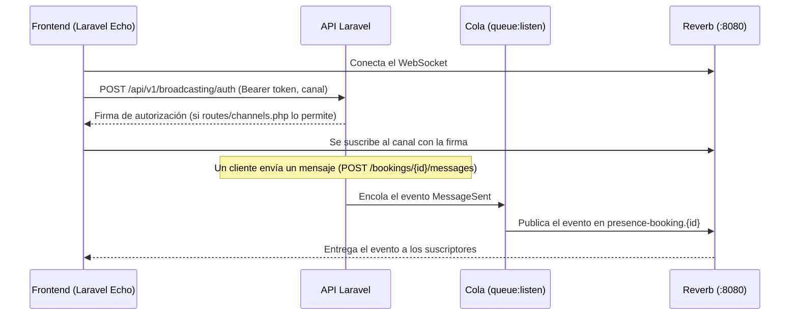

# Tiempo real (Laravel Reverb)

Chat de la reserva (HU011), estado en línea (HU041) y notificaciones al instante (HU018) usan WebSockets con [Laravel Reverb](https://laravel.com/docs/12.x/reverb). Decisión N2 de [modelo-de-datos.md](modelo-de-datos.md).

## Cómo funciona



La API y Reverb son procesos distintos. Los eventos pasan por la **cola**, así que el worker también debe estar corriendo.

## Levantarlo en local

```bash
composer dev    # API (:8000) + cola + Reverb (:8080) en una sola terminal
```

Variables en `.env` (ya vienen en `.env.example` con valores de desarrollo): `BROADCAST_CONNECTION=reverb` y `REVERB_*`.

En los tests el broadcasting está desactivado (`BROADCAST_CONNECTION=null` en `phpunit.xml`). Para verificar que un evento se emite, usa `Event::fake()` y `Event::assertDispatched(...)`.

## Canales

Definidos en `routes/channels.php`. Autenticación en `POST /api/v1/broadcasting/auth` con el mismo token Bearer de la API.

| Canal (nombre en el cliente) | Tipo | Quién entra | Para qué |
|------------------------------|------|-------------|----------|
| `booking.{id}` | Presencia | Cliente y profesional de la reserva (`App\Broadcasting\BookingChannel`) | Mensajes del chat, cambios de estado de la reserva y quién está en línea |
| `App.Models.User.{id}` | Privado | El propio usuario | Notificaciones (`$user->notify(...)` con canal `broadcast`) |

Un canal de presencia sirve a la vez para eventos y para saber quién está conectado, por eso el chat no necesita un canal aparte para el estado en línea.

## Eventos

Convención para todos los eventos que se transmiten:

- Clase en `app/Events`, implementa `ShouldBroadcast` (pasa por la cola).
- `broadcastOn()` devuelve el canal de la tabla anterior.
- `broadcastAs()` con nombre `recurso.accion` en minúsculas: `message.sent`.
- `broadcastWith()` devuelve el mismo Resource que la API, para que el frontend reciba la misma forma de datos.

```php
class MessageSent implements ShouldBroadcast
{
    public function __construct(public Message $message) {}

    public function broadcastOn(): PresenceChannel
    {
        return new PresenceChannel('booking.'.$this->message->booking_id);
    }

    public function broadcastAs(): string
    {
        return 'message.sent';
    }

    public function broadcastWith(): array
    {
        return (new MessageResource($this->message->load('sender')))->resolve();
    }
}
```

Eventos planeados (se implementan en sus módulos):

| Evento | Canal | Módulo |
|--------|-------|--------|
| `message.sent` | `booking.{id}` | Chat |
| `message.deleted` | `booking.{id}` | Chat |
| `booking.status-changed` | `booking.{id}` | Ciclo de vida de la reserva |
| Notificaciones de Laravel | `App.Models.User.{id}` | Notificaciones |

## Cliente (frontend)

Paquetes: `laravel-echo` y `pusher-js` (Reverb usa el protocolo de Pusher).

```ts
import Echo from 'laravel-echo'
import Pusher from 'pusher-js'

window.Pusher = Pusher

export const echo = new Echo({
  broadcaster: 'reverb',
  key: import.meta.env.VITE_REVERB_APP_KEY,
  wsHost: import.meta.env.VITE_REVERB_HOST,
  wsPort: Number(import.meta.env.VITE_REVERB_PORT),
  wssPort: Number(import.meta.env.VITE_REVERB_PORT),
  forceTLS: import.meta.env.VITE_REVERB_SCHEME === 'https',
  enabledTransports: ['ws', 'wss'],
  authEndpoint: `${import.meta.env.VITE_API_BASE_URL}/broadcasting/auth`,
  auth: { headers: { Authorization: `Bearer ${token}`, Accept: 'application/json' } },
})

// Chat de una reserva
echo.join(`booking.${bookingId}`)
  .here((users) => { /* quién está conectado ahora */ })
  .joining((user) => { /* entró la contraparte */ })
  .leaving((user) => { /* salió */ })
  .listen('.message.sent', (message) => { /* mismo formato que MessageResource */ })

// Notificaciones
echo.private(`App.Models.User.${userId}`).notification((notification) => { /* … */ })
```

El punto inicial en `'.message.sent'` es obligatorio: indica que es un nombre definido con `broadcastAs()`.

`VITE_REVERB_APP_KEY`, `VITE_REVERB_HOST`, `VITE_REVERB_PORT` y `VITE_REVERB_SCHEME` del frontend deben coincidir con `REVERB_APP_KEY`, `REVERB_HOST`, `REVERB_PORT` y `REVERB_SCHEME` del backend.

## Producción (AWS EC2)

- `php artisan reverb:start` y `php artisan queue:work` como servicios permanentes (Supervisor o systemd).
- Nginx delante de Reverb con TLS (`wss://`), redirigiendo el tráfico WebSocket al puerto interno 8080.
- Cambiar `REVERB_APP_KEY` / `REVERB_APP_SECRET` por valores propios y `REVERB_SCHEME=https`.
